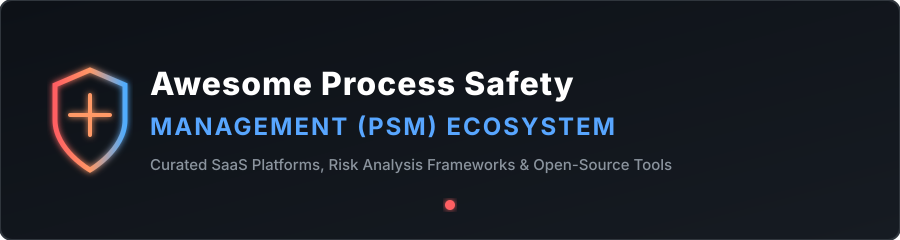

# Awesome Process Safety Management (PSM) 🛡️

   

## 📌 Top Process Safety Management (PSM) Platforms & Risk Engineering Ecosystem

**Curated List of SaaS Products, Industrial Risk Management Software & Open-Source GitHub Projects** 🚀

*Focused on Process Hazard Analysis (PHA/HAZOP), Management of Change (MOC), Incident Investigation, Bow-Tie Risk Assessment, Quantitative Risk Analysis (QRA), Mechanical Integrity, Compliance & High-Hazard Operations.* ⚙️

**Last updated: September 2026** 📅

---

### 💡 Overview & Market Landscape

This repository tracks top-tier commercial **SaaS platforms** and emerging **open-source repositories** for **Process Safety Management (PSM)** and Environmental Health & Safety (EHS). These software systems assist chemical, oil & gas, pharmaceutical, and high-hazard process facilities in fulfilling OSHA 1910.119 PSM, EPA RMP, and European Seveso III directives. 🏭

#### 📊 Market Size & Structure Analysis
- **Estimated Global EHS & PSM Software Market Size:** Valued at approximately **$2.5 Billion to $3.2 Billion (USD)**, growing at a CAGR of ~10.5%.
- **Market Dynamics & Fragmentation:** The enterprise PSM and operational risk sector is **moderately consolidated at the high end (private equity & industrial conglomerate backed)** but **fragmented across specialized niche modules** (e.g., custom HAZOP, SDS parsers, OT cyber-physical safety). Private equity firms (Blackstone, Thoma Bravo, CVC) and industrial giants (Wolters Kluwer, Hexagon AB, Fortive) continue to acquire category leaders, making it a high-barrier enterprise domain. 📈

---

## 📑 Table of Contents
- [SaaS / Commercial Hosted Platforms](#-saas--commercial-hosted-platforms)
- [Open-Source GitHub Projects](#-open-source-github-projects)
- [How to Contribute](#-how-to-contribute)
- [Disclaimer](#-disclaimer)
- [Star History](#-star-history)

---

## 💼 SaaS / Commercial Hosted Platforms

> [!NOTE]  
> Commercial enterprise suites dominate high-hazard compliance (OSHA PSM / Seveso) due to regulatory audit trail requirements and complex multi-site risk matrix configurations.

*Sorted by Company Size / Valuation / Revenue (Descending):* 🔽

| SaaS Product 🛠️ | Description 📝 | Company Valuation / Scale 💰 | Pricing 🏷️ | Free Tier Limits 🎁 |
| :--- | :--- | :--- | :--- | :--- |
| **[Sphera PSM](https://sphera.com/)** | Enterprise process safety management platform with strong capabilities in risk management, control of work, and high-hazard operations. | **$3.0 Billion Valuation** (Acquired by Blackstone for $1.4B in 2021) | Custom enterprise quotes (~$40,000/year base depending on scope/modules) | No free tier or public free trial; custom demo available upon request |
| **[SafetyCulture Enterprise](https://safetyculture.com/)** | Inspection and safety platform that scales to enterprise use cases including operational safety programs. | **$2.5 Billion Valuation** ($197M FY25 Revenue) | Premium plan starts at $24/user/month (billed annually) or $29/user/month (billed monthly) | Free forever plan available for up to 10 users with a 5 active template limit |
| **[Cority PSM](https://www.cority.com/)** | EHS platform with process safety capabilities alongside strong occupational health and industrial hygiene modules. | **~$2.0 Billion Valuation** (Majority owned by Thoma Bravo) | Custom enterprise quotes (~$40,000–$80,000/year typical mid-market entry) | No free tier or self-serve trial; enterprise demo available |
| **[ETQ Reliance](https://www.etq.com/)** | Quality and compliance platform that supports process safety, risk management, and regulated workflows. | **$1.2 Billion Valuation** (Acquired by Hexagon AB for $1.2B in 2022) | Custom enterprise quotes (base cloud deployments typically start around $10,000/year) | No free tier or trial period; direct vendor demo available |
| **[Intelex](https://www.intelex.com/)** | Configurable EHSQ platform used for process safety, incident management, audits, and compliance workflows at scale. | **$570 Million Valuation** (Acquired by Fortive / Industrial Scientific) | Starts at $49/user/month (Safety Essentials plan, minimum seat requirement) | No free tier or self-serve trial; live product demonstration available |
| **[VelocityEHS](https://www.velocityehs.com/)** | Mid-to-enterprise EHS platform with robust chemical management, risk visualization, and process safety support. | **$328 Million Valuation** (Backed by CVC Growth & Partners Group) | Custom enterprise quotes (~$9,000–$100,000+/year depending on tier/modules) | Free 30-day trial limited specifically to SDS management; core PSM via demo |
| **[Enablon (Wolters Kluwer)](https://www.enablon.com/)** | Leading enterprise operational risk and process safety platform built for large, high-hazard organizations. | **~$300 Million Valuation** (Acquired by Wolters Kluwer for €250M) | Custom enterprise quotes (~$50,000+/year for global enterprise scope) | No free tier or public trial; custom sales demo provided |
| **[Benchmark Gensuite](https://www.benchmarkgensuite.com/)** | EHS platform offering process safety and related modules with AI-assisted capabilities. | **Private Enterprise** (Backed by Vista Equity Partners growth investment) | Custom enterprise quotes scaled by site count and active application modules | No free tier or free trial; guided "Test Drive" / demo available |
| **[ProcessMAP](https://www.processmap.com/)** | EHS and sustainability platform that includes process safety and operational risk management features. | **Private Enterprise** (Acquired by Ideagen Group) | Custom enterprise quotes based on organization size and module selection | No free tier or trial; live demo provided upon request |
| **[PETROSIM Safety](https://www.kbc.global/)** | Specialized process simulation and safety analysis tools used in oil, gas, and chemical industries. | **Sub-Unit of Yokogawa** (Under KBC Advanced Technologies) | Custom industrial license quoting per site/user suite deployment | No free tier or public trial; pilot evaluation available for enterprise clients |

---

## 🔓 Open-Source GitHub Projects

> [!TIP]  
> Open-source projects offer modular components for hazard analysis, safety data sheet (SDS) parsing, threat modeling, and OT cyber-physical safety.

*Sorted by GitHub Star Count (Descending):* 🔽

| Project / Repository 📦 | Star Count ⭐ | Description 📝 |
| :--- | :--- | :--- |
| **[arnepadmos/threats](https://github.com/arnepadmos/threats)** |  | Curated threat modeling resources and risk frameworks, including Bow-Tie risk matrix methodologies for process safety. |
| **[anandman/functional-safety](https://github.com/anandman/functional-safety)** |  | Complete functional safety (ISO 26262 / IEC 61508) document set including Hazard Analysis & Risk Assessment (HARA). |
| **[khoivan88/find_sds](https://github.com/khoivan88/find_sds)** |  | Automated Python utility to fetch and download chemical Safety Data Sheets (SDS) in PDF format using CAS numbers. |
| **[astepe/sds_parser](https://github.com/astepe/sds_parser)** |  | Open Python library and parser tool to extract chemical hazards, NFPA ratings, and data from Safety Data Sheets. |
| **[USEPA/CompTox-PK-CvTdb](https://github.com/USEPA/CompTox-PK-CvTdb)** |  | US EPA Computational Toxicology Concentration vs Time Database for chemical exposure risk modeling and safety assessment. |
| **[p4lsec/otsafe](https://github.com/p4lsec/otsafe)** |  | Detection-as-Code & process safety modeling framework for operational technology (OT) and cyber-physical control systems. |
| **[CrucibleSDS/tungsten](https://github.com/CrucibleSDS/tungsten)** |  | Lightweight material safety data sheet (MSDS / SDS) parsing library built for chemical management workflows. |
| **[braedonsaunders/beaconhs](https://github.com/braedonsaunders/beaconhs)** |  | Open-source HSE platform for industrial construction covering incidents, inspections, training, equipment, permits, and a form engine. |

---

### 🛠️ Architecture Framework for Building Custom PSM Systems
1. **Document Control & SDS Management**: Start with `find_sds` & `sds_parser` for chemical safety data ingestion.
2. **Hazard Analysis & Risk Modeling**: Utilize `arnepadmos/threats` and `anandman/functional-safety` for HAZOP and Bow-Tie risk mapping.
3. **Operational Technology Protection**: Deploy `p4lsec/otsafe` for OT sensor monitoring and safety integrity level (SIL) enforcement.

---

## 🤝 How to Contribute

1. Fork the repository.
2. Add/edit entries in `README.md` following the table schema.
3. Ensure pricing, valuation, and star count badges follow the standard format.
4. Submit a Pull Request with a clear summary of additions.

For more awesome lists, check out [Awesome-Awesome-Awesome](https://github.com/ishandutta2007/Awesome-Awesome-Awesome)! ⭐

---

## ⚠️ Disclaimer

- This repository is a **community-curated index** for informational and educational purposes only.
- Process Safety Management involves regulated, high-hazard operations (OSHA PSM 1910.119, EPA RMP, Seveso III Directive). Software implementation requires professional process safety engineering validation.

---

## 📈 Star History

---

**Made with ❤️ for Process Safety Engineers, EHS Leaders, & High-Hazard Plant Operators.** 🏭✨
